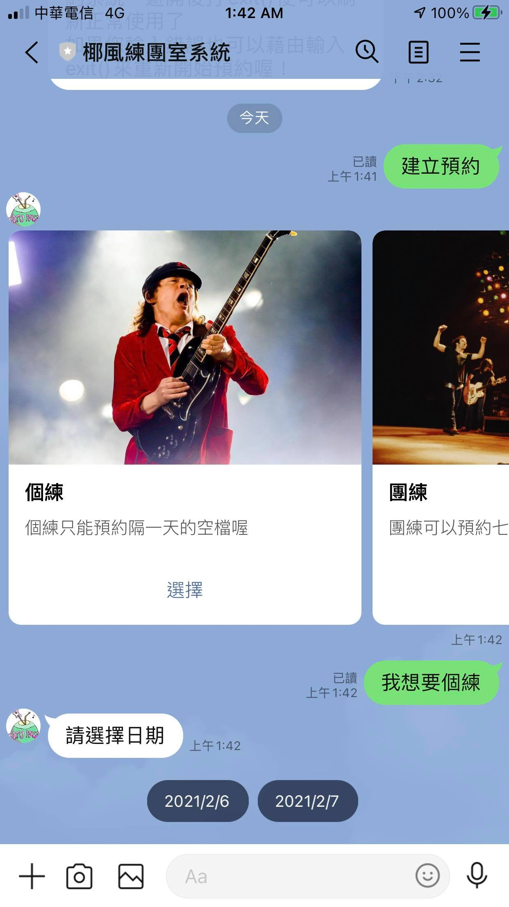
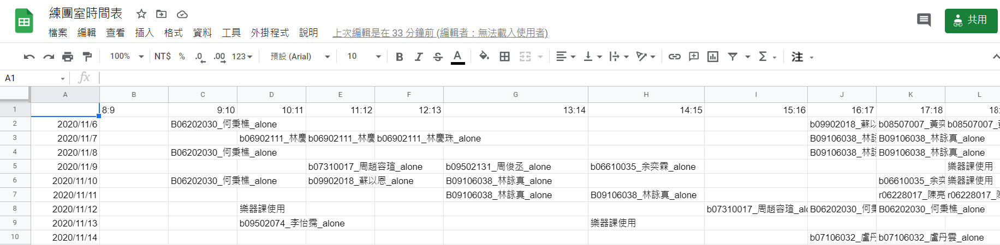

# linebot-booking-system
## Usage
It's a simple reservation system for the band practice room of nturockclub. It will ask a sequence of questions to users and book the practice room. It also connect with the google sheet which make the club manager easy to know who use the room at which time.\
App Appearence: \
\
Google Sheet Appearence (The first row of the sheet is the time and the fist column is the date that user borrowed): \

